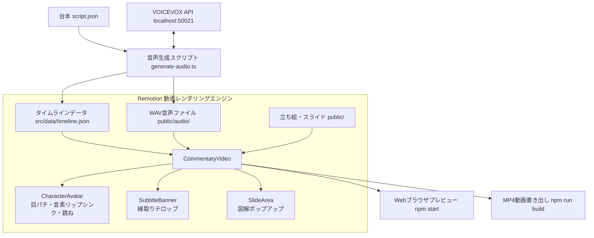

# 実装計画: ずんだもん解説動画自動生成ツール (Remotionベース)

台本（JSON/Markdown）から、音声合成（VOICEVOX）によるWAV・音素タイミング情報取得、立ち絵（ずんだもん・四国めたん等）の自動リップシンク・目パチ・バウンスアニメーション、YouTube風テロップ、スライド表示を組み合わせて、RemotionでプレビューおよびMP4レンダリングできる自動化ツールを新規開発します。

## ユーザー確認事項 (User Review Required)

> [!IMPORTANT]
> **VOICEVOXの稼働環境について**:
> - 本ツールはローカルの VOICEVOX Engine API (`http://localhost:50021`) を呼び出します。
> - VOICEVOX が未起動の場合でも開発・プレビューが確認できるよう、**モックモード（ダミー音素と無音/代替音声による自動プレビュー機能）** を備えたスクリプトを実装します。実音声での動画化時は、VOICEVOXアプリ（またはDocker）を起動してご利用いただけます。

## アーキテクチャと処理フロー

## 提案する変更内容 (Proposed Changes)

新規フォルダ `apps/zundamon-commentary-remotion` 配下にすべてのコンポーネントを構築します。

### 1. プロジェクト基盤
#### [NEW] `apps/zundamon-commentary-remotion/package.json`
- `remotion`, `@remotion/cli`, `react`, `react-dom`, `typescript`, `@types/react`, `node-fetch` などのセットアップ。
#### [NEW] `apps/zundamon-commentary-remotion/tsconfig.json`
- React 19 / JSX / ESNext 向け TypeScript 設定。
#### [NEW] `apps/zundamon-commentary-remotion/remotion.config.ts`
- Remotion の設定（解像度 1920x1080、30fps、Chromiumフラグなど）。
#### [NEW] `apps/zundamon-commentary-remotion/README.md`
- プロジェクト概要、使い方（台本の書き方、音声生成手順、プレビュー、レンダリング）、素材差し替えガイド、更新履歴。

### 2. データ定義と音声生成パイプライン
#### [NEW] `apps/zundamon-commentary-remotion/src/data/script.json`
- セリフ、話者（`zundamon` / `metan`）、表情（`normal`, `happy`, `angry`, `surprised`）、表示スライド画像、BGM指定を含むサンプル台本。
#### [NEW] `apps/zundamon-commentary-remotion/scripts/generate-audio.ts`
- VOICEVOX API (`/audio_query`, `/synthesis`) を呼び出し、WAV ファイルと詳細な音素タイミング（`mora.vowel_length` 等）をパース。
- 各セリフの開始フレーム、終了フレーム、リップシンク用の母音キーフレーム列を `timeline.json` として出力。
- VOICEVOXが起動していない場合は、自動的にフォールバック（文字数に応じたモックタイムライン生成）を行う安全設計。

### 3. Remotionコンポーネント群
#### [NEW] `apps/zundamon-commentary-remotion/src/components/CharacterAvatar.tsx`
- 立ち絵レンダラー：
  - **リップシンク**: タイムラインの音素データ（a, i, u, e, o, n）に応じて口パーツ（開閉・形状）をリアルタイム切り替え。
  - **目パチ**: 3〜4秒おきにランダムで瞬きアニメーション。
  - **バウンス演出**: セリフ開始時に `spring()` でピョコッと跳ねるアニメーション。
  - **表情差分**: 表情タグに応じたパーツ組み合わせ。
#### [NEW] `apps/zundamon-commentary-remotion/src/components/SubtitleBanner.tsx`
- YouTube解説動画定番の、縁取り（ドロップシャドウ・アウトライン）付き字幕。話者ごとのテーマカラー（ずんだもん：黄緑・エメラルド、めたん：ピンク・パープル等）。
#### [NEW] `apps/zundamon-commentary-remotion/src/components/SlideArea.tsx`
- スライド・図解画像を中央上部に表示。登場時のスムーズなスケールイン・フェードイン。
#### [NEW] `apps/zundamon-commentary-remotion/src/components/Background.tsx`
- 部屋や幾何学模様、落ち着いた解説用背景の描画。
#### [NEW] `apps/zundamon-commentary-remotion/src/CommentaryVideo.tsx` & `src/Root.tsx`
- 各コンポーネントをレイヤー統合し、タイムラインデータに基づいて全自動同期。

### 4. 素材アセット
#### [NEW] `apps/zundamon-commentary-remotion/public/characters/`
- ずんだもん・めたんの立ち絵パーツ（SVG/PNGプレースホルダーパーツ。市販・フリー素材の差し替えが容易な構造）。
#### [NEW] `apps/zundamon-commentary-remotion/public/slides/`
- サンプル解説用図解画像。

---

## 検証計画 (Verification Plan)

### 自動/コマンド検証
1. **依存関係のインストール**:
   `cd apps/zundamon-commentary-remotion && npm install`
2. **タイムライン・音声生成スクリプトの実行**:
   `npm run generate` (モックモードおよびVOICEVOX接続確認)
3. **ビルド検証**:
   `npx tsc --noEmit` で型チェックをパスすることを確認。
4. **Remotion MP4レンダリングテスト**:
   `npx remotion render src/index.ts CommentaryVideo out.mp4 --frames=0-90` (最初の3秒間をレンダリングして正常完了を確認)

### 手動確認
- `npm run start` でRemotion Previewがローカルブラウザ（ポート3000等）で立ち上がり、タイムライン再生・口パク・字幕表示が意図通り同期されていることを確認。
